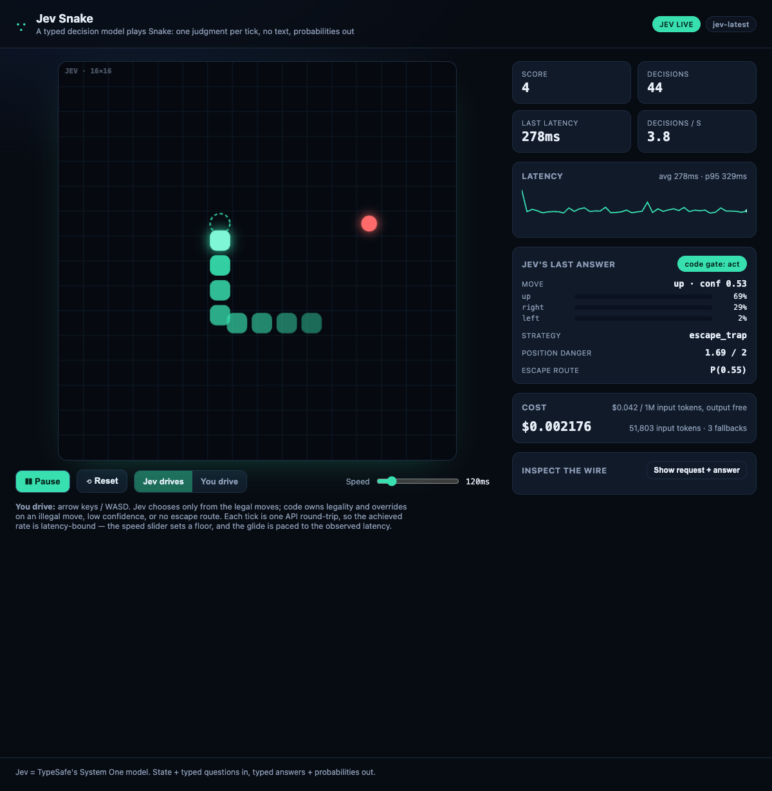

# jev-snake

Snake, auto-played by **[Jev](https://docs.typesafe.ai)**, TypeSafe AI's System One model.

Jev is a decision model, not an LLM: you send a state plus typed questions and it returns typed
answers with calibrated probabilities in tens-to-hundreds of milliseconds, with no text generation.
Here it plays Snake — one small, typed decision per tick.



This is a simple demo of the pattern TypeSafe documents for real-time control:

```text
board + facts (computed in code)
      │
      ▼
one request to Jev: move (Choice) · strategy (Choice) · danger (Score) · escape (Noul) · food-aligned (Noul)
      │  typed answers + probabilities + confidence, evaluated in parallel
      ▼
code gate: is the move legal? confident enough? an escape route?
      │
      ├── act on Jev's move
      └── otherwise fall back to a deterministic safe move
```

The interesting part is the boundary: **Jev supplies the judgment; the code owns every deterministic
thing** — the board, legal moves, arithmetic, thresholds, and the side effect.

## Run it

Requires Node.js 20+ (tested on Node 24). No dependencies, no build step.

```bash
# put your key in .env
echo 'TYPESAFE_API_KEY=sk_...' > .env

node server.mjs
# open http://127.0.0.1:4321
```

Without a key, the server runs a deterministic local bot so the demo still works; the header badge
shows `SIMULATED (no key)`. Add the key and reload to let Jev drive.

## Controls

- **Play / Pause**, **Reset**.
- **Jev drives** vs **You drive** (arrow keys / WASD).
- **Speed**: target ms per tick (40–600 ms). Each tick is one API round-trip, so the achieved rate is
  latency-bound; the stats show the target and the achieved decisions/second.
- **Show request + answer**: the exact JSON sent to TypeSafe and the typed answers returned.
- **Cost**: running estimate at $0.042 / 1M input tokens (output tokens are free).

## Data sent to TypeSafe

Every tick sends, to `POST https://api.typesafe.ai/v1/systemone`:

- a small JSON `state`: the ASCII board (`#` body, `S` head, `F` food, `.` empty), grid size, head,
  direction, food, snake length, the legal moves, and code-computed facts (distance to food, open
  space from the head);
- five typed questions: `move` (Choice over legal moves), `strategy` (Choice), `position_danger`
  (Score), `escape_route` (Noul), `aligned_with_food` (Noul).

No personal data. The API key is read server-side only and is never sent to the browser. TypeSafe
says customer requests are not used to train models; check their current terms for details.

## Tests

```bash
node --test
```

Nine `node:test` cases cover the board, the eat-aware legality rule (including the "move into the
vacating tail" case), and the decision gate. They run offline — no API key needed.

## How it is wired

- `server.mjs` — static server + TypeSafe client + board/facts/question building + the code-owned
  move gate. The only file that calls the API.
- `public/index.html`, `public/styles.css`, `public/app.js` — the game and the live decision panel.
- `test.mjs` — offline tests for legality and the gate.

The gate is deliberately explicit (`composeDecision` in `server.mjs`):

1. If Jev returns a move that is not legal → deterministic safe fallback.
2. If move confidence < 0.3 → fallback.
3. If Jev's own escape probability < 0.2 → fallback.
4. Otherwise act on Jev's move.

`position_danger` is recorded for inspection but does not gate.

## Notes

- Observed from Europe against the West-Coast endpoint: ~230–700 ms per decision, ~3.5–4 decisions/s,
  about $0.006 per 100 decisions. TypeSafe quotes 70–500 ms; your latency depends on network path.
- This is an independent project and is not affiliated with or endorsed by TypeSafe AI.

## License

MIT — see [LICENSE](./LICENSE).
